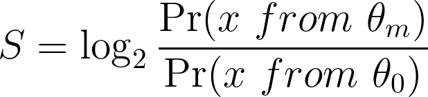
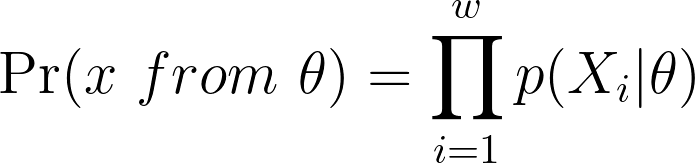

# Scan a DNA sequence for motif matching

Due April 8, 2022

## 1. Implement motif matching scan (6 pt)

Given a DNA sequence of length N and the position weight matrix (PWM) of a motif of length w, the goal is to scan the DNA sequence and its reverse complement to calculate a motif matching score at every position. The output will be two lists of scores, which can generate two curves representing the motif matching pattern for the sequence and its reverse complement, respectively. For simplicity, the DNA sequence contains A, C, G, T only, i.e., no N.

The motif matching score can be calculated as a log likelihood ratio:

where

 is the motif PWM,

 is the genome background. 

(A, C, G, T)=[0.28, 0.22, 0.22, 0.28]

In practice, as we are only interested in a positive matching score, the final output score can be adjusted as

max(S, 0)

## 2. Run motif matching scan (3 pt)

Run motif matching scan on the 11 provided sequences for the RBPJ motif. Generate plots for the RBPJ motif matching patterns for each sequence. Use different colors for the two curves for original sequence and its reverse complement sequence.

The PWM can be found at:
[rbpj_pwm.txt](rbpj_pwm.txt)

The sequences can be found at:
[notch1_binding_sequences.fa](notch1_binding_sequences.fa)

## 3. Discuss any interesting observations you find from the results. (1 pt)
